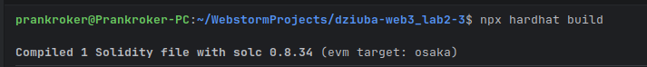
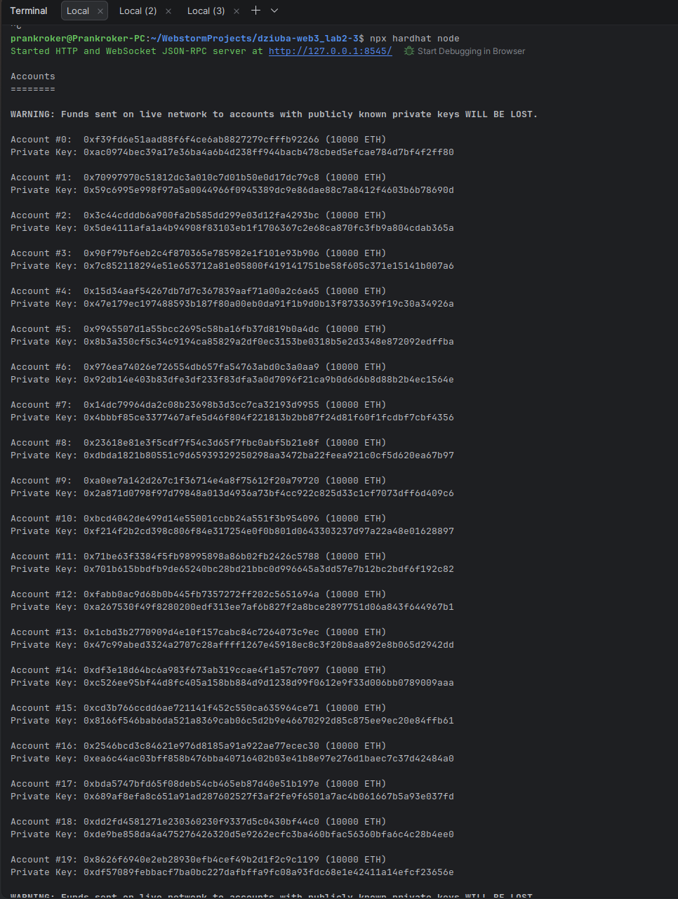
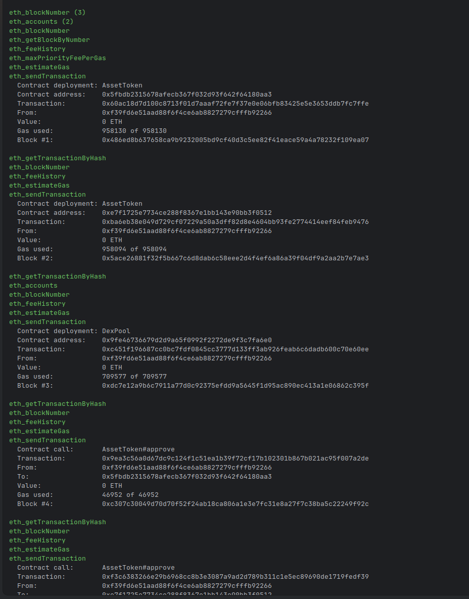
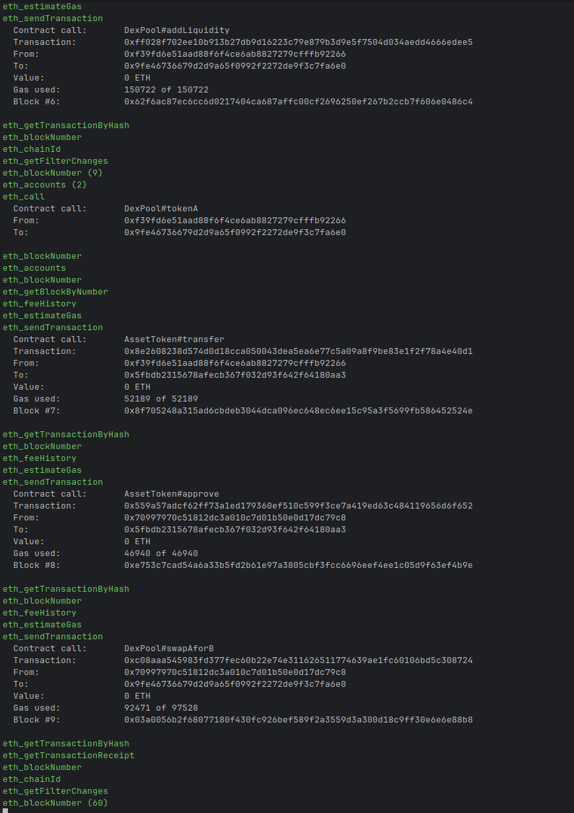
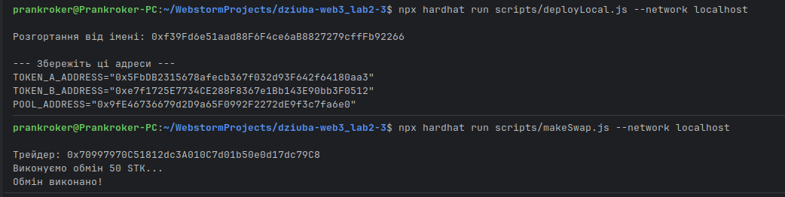
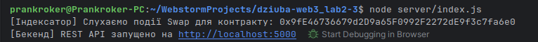

## Контрольні запитання

### 1. Чому розробники Web3-додатків називають Go "нативною" мовою екосистеми Ethereum?
Офіційний і найбільш поширений референсний клієнт вузла мережі Ethereum - Geth (Go-Ethereum) - повністю написаний мовою Go. Розробляючи сервіси на Go, інженери можуть імпортувати безпосередньо базові криптографічні та протокольні пакети (`go-ethereum`), на яких базується сам консенсус мережі. Крім того, Go має вбудовану кодогенерацію контрактних прив'язок через утиліту `abigen`, забезпечує високу продуктивність завдяки горутинам та компіляції в нативний код, а також гарантує 100% сумісність форматів даних (RLP-серіалізація, Keccak-256, типи великих чисел).

---

### 2. Яка архітектурна проблема вирішується за рахунок збереження блокчейн-подій у реляційну базу даних замість прямого опитування блокчейну з фронтенду?
Блокчейн спроєктований як децентралізований розподілений реєстр для верифікації стану, а не як аналітична СУБД. Прямі запити до RPC-вузлів (наприклад, через `eth_getLogs`) мають серйозні обмеження:
- Вони повільні та створюють велике навантаження на ноди.
- Публічні RPC-провайдери (Infura, Alchemy) встановлюють жорсткі ліміти (Rate Limits) на діапазон блоків та кількість запитів.
- Блокчейн не підтримує сортування, складні JOIN-запити, реляційні зв'язки, повнотекстовий пошук та класичну пагінацію.

Збереження логів у реляційну БД (PostgreSQL/SQLite) за допомогою сервісу-індексатора дозволяє кешувати історію подій та повертати клієнту аналітичні дані за мілісекунди через оптимізований REST або GraphQL API без витрат на блокчейн-запити.

---

### 3. Що означає ключове слово indexed у декларації події смарт-контракту, і де фізично зберігаються ці індексовані параметри в лозі (Topics vs Data)?
Ключове слово `indexed` вказує компілятору Solidity, що цей параметр події призначений для швидкої фільтрації та пошуку за допомогою фільтрів bloom-filter у блоках.
- **Topics (Теми):** Індексовані параметри (максимум до 3-х у події) зберігаються у масиві `topics` логу. Перший топік (`topics[0]`) — це завжди `keccak256`-хеш сигнатури самої події (наприклад, `keccak256("Swap(address,uint256,uint256)")`), а наступні (`topics[1]`, `topics[2]`) містять 32-байтні значення індексованих аргументів (наприклад, адреса `trader`).
- **Data (Дані):** Усі неіндексовані параметри (у нашому випадку `amountIn` та `amountOut`) кодуються за правилами ABI та зберігаються єдиним байтовим масивом у полі `data` квитанції транзакції. Вони не можуть використовуватися для прямої апаратної фільтрації на рівні вузла.

---

### 4. Чим відрізняється HTTP Polling від підключення через WebSockets при зчитуванні подій з RPC-провайдера?
- **HTTP Polling:** Клієнт періодично (наприклад, кожні 5 секунд) надсилає HTTP POST-запит до RPC-сервера з викликом `eth_getFilterChanges` або `eth_getLogs`. Це створює постійний мережевий оверхед (заголовки HTTP, TCP/TLS рукостискання) і затримку (latency) між генерацією події в блоці та моментом, коли клієнт її отримає.
- **WebSockets (WSS):** Встановлюється постійне двостороннє TCP-з'єднання, в якому використовується механізм `eth_subscribe("logs", ...)`. Як тільки вузол формує новий блок із подією, сервер самостійно "проштовхує" (push-повідомлення) лог клієнту в реальному часі без необхідності регулярних опитувань. Це значно знижує трафік і зменшує затримку обробки транзакцій.